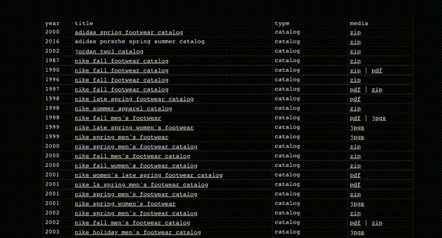

# Ghost Publication Directory Table

Licensed under the MIT License; you may use, modify, and redistribute this table.

This guide explains how to preview, embed, and customize a sortable directory table for Ghost publications. Everything ships as plain HTML, CSS, and vanilla JavaScript so you can paste it into Ghost or integrate it into your theme.



## Files Included
- `index.html` — Demo page with sample rows and assets wired up.
- `assets/css/directory-table.css` — Scoped table styles.
- `assets/js/sortable-table.js` — Dependency-free sorter bound to elements tagged with `data-sortable-table`.

## Highlights
- Keyboard-friendly column sorting with optional numeric comparison.
- Neutral styling that plays nicely with existing Ghost themes.
- Drop-in markup ready for Ghost cards or site-wide injection.

## Preview Locally
1. Clone or download this folder.
2. Open `index.html` in a browser.
3. Swap the sample `<tbody>` rows with your publication data to see it live.

## Embed in Ghost

### Option 1: Custom HTML card (single post/page)
1. In the Ghost editor, add an **HTML** card.
2. Paste the snippet below and replace the sample rows.
3. Publish or update the post.

### Option 2: Site-wide code injection
1. Paste the CSS block into **Settings → Code injection → Site header**.
2. Paste the script block into **Site footer**.
3. Insert the table markup wherever you need the directory (without repeating the style/script blocks).

```html
<style>
.directory-table-wrap{width:100%;max-width:960px;margin:0 auto 24px;overflow-x:auto}
.directory-table{border-collapse:collapse;width:100%;min-width:320px;background:#fff;font-family:'Helvetica Neue',Arial,sans-serif;font-size:14px;line-height:1.4}
.directory-table caption{text-align:left;font-weight:600;font-size:16px;margin-bottom:12px}
.directory-table th,.directory-table td{border:1px solid #d0d0d0;padding:8px 10px;text-align:left;vertical-align:top;background:#fff}
.directory-table th{background:#f6f6f6;font-weight:600}
.directory-table a{color:inherit;text-decoration:underline}
.directory-table a:hover,.directory-table a:focus{text-decoration:none}
.directory-table [data-sortable]{cursor:pointer;position:relative;user-select:none}
.directory-table [data-sortable]::after{content:'';display:inline-block;border:5px solid transparent;border-top-color:#888;margin-left:6px;opacity:0;transform:translateY(2px)}
.directory-table [data-sort-direction=asc]::after,.directory-table [data-sort-direction=desc]::after{opacity:1}
.directory-table [data-sort-direction=desc]::after{transform:rotate(180deg) translateY(-2px)}
.directory-table tbody tr:nth-child(even) td{background:#fafafa}
@media (max-width:640px){.directory-table th,.directory-table td{padding:6px 8px;font-size:13px}}
</style>
<div class="directory-table-wrap">
  <table class="directory-table" data-sortable-table>
    <thead>
      <tr>
        <th scope="col" data-sort-type="number">Year</th>
        <th scope="col">Publication</th>
        <th scope="col">Focus</th>
        <th scope="col">Link</th>
      </tr>
    </thead>
    <tbody>
      <tr>
        <td>2024</td>
        <td>Starter Weekly</td>
        <td>Newsletters</td>
        <td><a href="https://example.com/starter-weekly" rel="noopener">View publication</a></td>
      </tr>
      <tr>
        <td>2022</td>
        <td>Creator Stories</td>
        <td>Case Studies</td>
        <td><a href="https://example.com/creator-stories" rel="noopener">View publication</a></td>
      </tr>
    </tbody>
  </table>
</div>
<script>
(function(){
  'use strict';
  function toArray(list){ return Array.prototype.slice.call(list || []); }
  function getCellText(row, index){
    var cell = row.cells[index];
    return cell ? (cell.textContent || cell.innerText || '').trim() : '';
  }
  function parseNumber(value){
    var number = Number(String(value).replace(/[^0-9.+-]/g, ''));
    return isFinite(number) ? number : NaN;
  }
  function compareFactory(index, direction, type){
    var collator = new Intl.Collator(undefined, { numeric: true, sensitivity: 'base' });
    return function(rowA, rowB){
      var valueA = getCellText(rowA, index);
      var valueB = getCellText(rowB, index);
      if (type === 'number'){
        var numberA = parseNumber(valueA);
        var numberB = parseNumber(valueB);
        if (!isNaN(numberA) && !isNaN(numberB)){
          return direction === 'asc' ? numberA - numberB : numberB - numberA;
        }
      }
      var comparison = collator.compare(valueA, valueB);
      return direction === 'asc' ? comparison : -comparison;
    };
  }
  function bindTable(table){
    if (!table || !table.tBodies || !table.tBodies[0]) return;
    var headers = toArray(table.querySelectorAll('thead th'));
    var body = table.tBodies[0];
    headers.forEach(function(header, index){
      if (header.getAttribute('data-sort-disabled') === 'true') return;
      header.setAttribute('data-sortable', 'true');
      header.setAttribute('tabindex', '0');
      header.setAttribute('role', 'button');
      function toggleSort(){
        var direction = header.getAttribute('data-sort-direction') === 'asc' ? 'desc' : 'asc';
        headers.forEach(function(other){ other.removeAttribute('data-sort-direction'); });
        header.setAttribute('data-sort-direction', direction);
        var rows = toArray(body.rows).sort(compareFactory(index, direction, header.getAttribute('data-sort-type')));
        rows.forEach(function(row){ body.appendChild(row); });
      }
      header.addEventListener('click', toggleSort);
      header.addEventListener('keydown', function(event){
        if (event.key === 'Enter' || event.key === ' '){
          event.preventDefault();
          toggleSort();
        }
      });
    });
  }
  function init(){
    toArray(document.querySelectorAll('[data-sortable-table]')).forEach(bindTable);
  }
  if (document.readyState === 'loading') document.addEventListener('DOMContentLoaded', init);
  else init();
})();
</script>
```

## Customize
- Add `data-sort-type="number"` to numeric headers so the sorter treats values as numbers.
- Use `data-sort-disabled="true"` on any header that should stay unsortable.
- Override the visuals by targeting `.directory-table` in your Ghost theme or wrapping it in your own class.

## License
Released under the MIT License. See `LICENSE` for full text.
